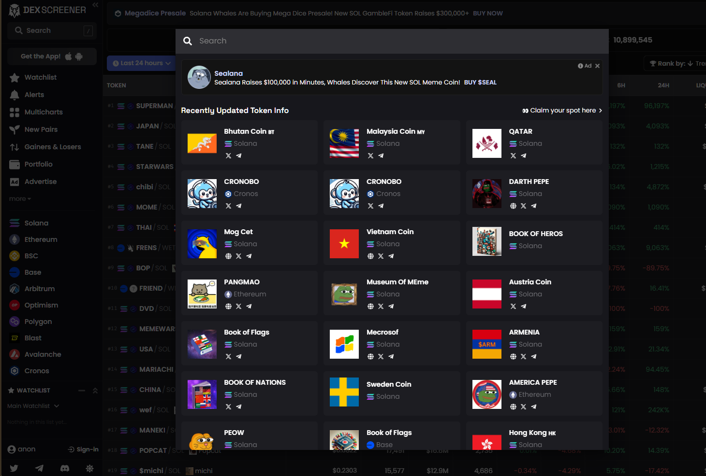
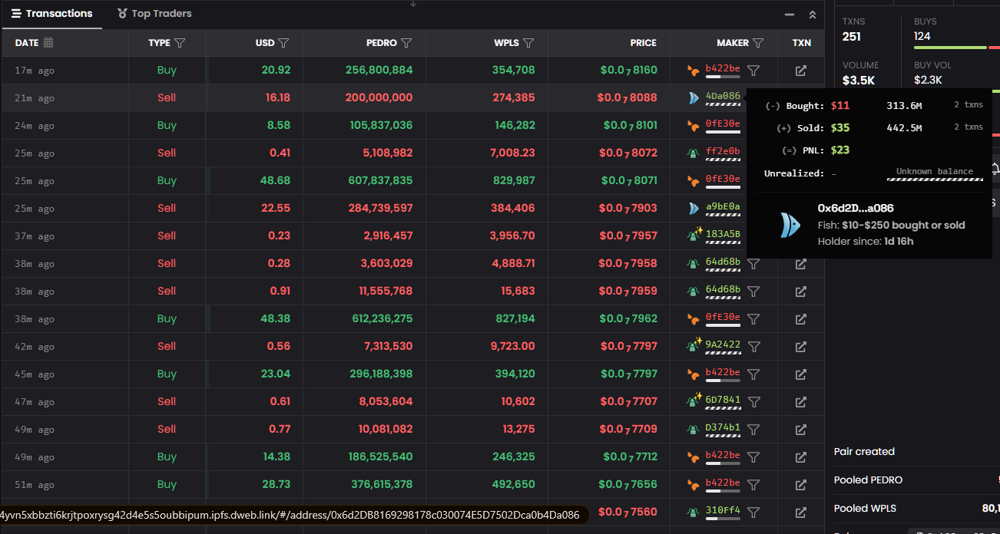

Reverse engineering dexscreener avro encryption to fit my web scraping needs

Before running the api, make sure you have node >= v18 installed

## Running the api
```bash
npm install
node main.js
```

## Using Docker
```bash
docker build -t dexscreener:v1 .
docker run -d --name dexscreener-api -p 3000:3000 dexscreener:v1
```

## Sending requests
There are 2 important endpoints:
- GET `/pairs` - use query parameter `q` to pass token address
This endpoint is called on dexscreener.com when you try to search token pairs, it returns the decrypted results as json


- GET `/logs` - supported query parameters: `q` for token address, `m` for wallet hash and `c` which should be set to `1`. 
For pagination, if you want to get results above page 1, set query parameter `bbn` `blockNumber` to value which is returned by previous page (`blockNumber` field)
Get transaction logs of a wallet in a pool (including summary data)


  